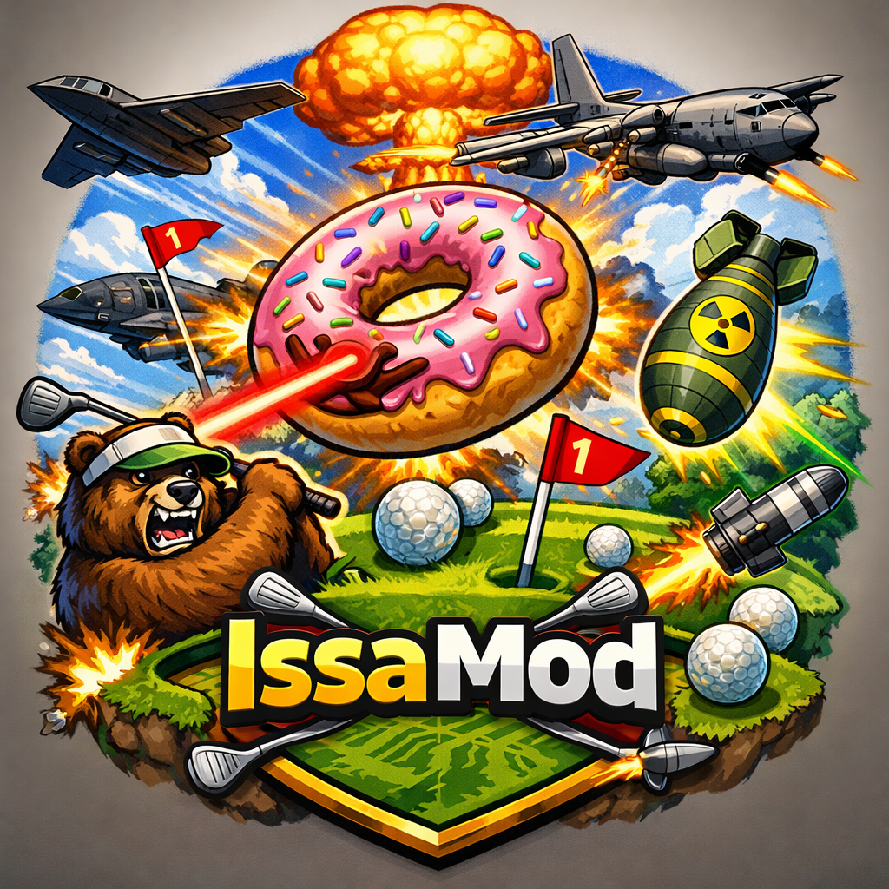

# IssaMod



Adds **28 new items** to Super Battle Golf -- from an orbiting gunship you pilot from above, to a pack of angry attack bears. All items drop from standard item boxes and are fully configurable.

To download and/or install the mod, please check out the GitHub releases or the mod's [ThunderStore page](https://thunderstore.io/c/super-battle-golf/p/TeamScusemua/IssaMod/).

## Items

### ⚾ Baseball Bat
A melee weapon that replaces your golf club swing. Wind up and send anyone in range flying. Straightforward, personal, deeply satisfying.

### 🛩️ AC-130 Gunship
You become the gunship. The plane circles the map at altitude while you stare down a targeting camera and rain rockets on your friends. Fire is free, ammo is infinite, and the only limit is how long you can stay on station (and also the configured time-limit). Hit the mayday button and the gunship nosedives -- your opponents can lock onto it with a rocket launcher and shoot it down before it reaches them. If they can't, the crash does the work for you.

### 💣 Stealth Bomber
Paint a target on the course from ground level, then confirm the strike. Moments later a B-2 roars overhead and carpets the area with bombs. Great for punishing anyone who stops moving. The bomber itself is a valid rocket launcher target -- lock on before the run completes to intercept it.

### 🎯 Predator Missile
You pilot the missile. It drops from altitude and you steer it directly with your camera from a sort of first-person view until it hits something or you let go. 

### ⚛️ Nuke 
Drop a nuclear bomb that blows all of the other players sky-high!

### 🍩 Giant Flying Donut
A massive donut spawns and you pilot it around the course from a third-person perspective. It follows the terrain at low altitude, fires downward lasers as it passes over players, and can be shot down with standard weapons. Equal parts absurd and devastating.

### 🐻 Attack Bears
Summons AI-controlled battle bears onto the course. Bears chase down the nearest player, wind up, and launch them like a ball. They take damage from all weapons -- guns, clubs, the bat, rockets, explosions -- and become more aggressive when they get hit. Bears are persistent until killed, which means your bears are everyone's problem. And your own.

### 🧊 Freeze World
Turn the world into ice and watch as everybody helplessly slips around.

### 🌌 Low Gravity
Reduces gravity across the entire course for a configurable duration. Shots fly further, players float on hits, and any ball already airborne gets a free extension. Can backfire badly on anyone with a long putt already in motion. (And yes, the swing preview / power bar IS adjusted during low gravity.)

### 🎯 M200 Intervention
A scoped sniper rifle. Right-click to zoom and show the scope overlay. Fire to hit instantly at any range without the backwards-knockback dive of the Elephant Gun. Tight spread when scoped, normal spread when hipfired. One shot, one hole in someone's plan.

### ⚡ Javelin 
Locks onto a ground target point and flies a lofted arc: up, turn at apex, dive straight down.

### 💥 Sticky Grenade
Thrown with an arc preview so you know exactly where it's going. Sticks to whatever it lands on -- terrain, structures, or a player who wasn't paying attention. Detonates on a fuse. If it sticks to a player, they have a few seconds to contemplate their choices.

### 🌀 Black Hole Grenade
Thrown with an arc preview. Lands and opens a black hole that pulls every nearby player and object toward its center for several seconds, then violently ejects everything outward in random directions. Good luck putting after that.

### 🧱 Placeable Wall
Plants a destructible brick wall wherever you're standing. Useful for blocking shots, redirecting players, or just making the course more chaotic. The wall takes damage from rockets, explosives, golf clubs, and the baseball bat -- it will eventually come down, but it might save you long enough for it to matter.

### 🔫 AK-47
A rapid-fire sub-machine gun. Hold the fire button and spray bullets downrange at high speed. Each bullet hits independently, so sustained fire on a target adds up fast. Accuracy degrades with range, so this one rewards getting close.

### 🔄 Position Swap
Pick any other player from the chooser overlay. Warning circle appear around both of you while a short countdown runs -- then you swap positions in a burst of smoke. Great for dumping someone into a bad lie or pulling yourself out of one. Can't be used on players sitting in a golf cart.

### 🧪 Poison Jar
Lob a jar of poison with an arc preview. On landing it shatters and douses anyone within the blast radius -- including you, if your aim is bad. Poisoned players suffer a full screen of visual distortion: camera roll, FOV breathing, double vision, and aim drift that makes lining up a shot genuinely difficult. The radius and duration are both configurable, so you can turn it into a small precise splash or a wide lingering cloud.

### 🛸 Drone Swarm
Deploys a swarm of kamikaze drones that fan out overhead and circle the course. Each drone flies independently with erratic noise-driven steering, then picks a random target and dives. They home in continuously until they get close, then lock their aim point and fly straight -- so a target that moves fast enough can actually dodge. The swarm size scales with the number of players in the match. A HUD counter shows how many drones are still airborne. Session ends when every drone has either detonated or the time limit expires.

### 🐂 Red Bull
Gives you wings. Cracks open a can and grants a speed boost more powerful than coffee, plus a jump height boost that lasts for its duration. Use it to cross the course fast, escape a bad situation, or just make yourself a much harder target to hit.

### 🍩 Super Donut
Trigger an orbital laser on all other players at the same time.

### 🌗 Gravity Gun
Like the icon weapon from the Half Life franchise, use the Gravity Gun to throw players and golf carts around with ease!

### ✈️ Harrier Jet
Calls in an autonomous Harrier jet that flies in from off-map, hovers over the course, and fires rockets at players on its own. No steering required after activation — you just point and watch. Can be shot down with a rocket launcher before it finishes its run.

### 🚀 Rocket Tether
Targets another player and fires a rocket that spawns directly above them, then launches straight up. The target is tethered to the rocket by a spring force and gets dragged skyward with it. When the timer runs out, the rocket detonates at altitude. 

### 🎒 Jetpack
Strap on a jetpack and hold the fire button to thrust upward. Each canister provides a set amount of burn time; releasing the button pauses fuel consumption, so you can pulse the thrust. A fuel gauge HUD shows how much burn time is left in the current canister.

### 📡 Teleporter
The camera pans to a top-down overhead view of the course and a glowing marker appears on the ground. Move the marker with WASD to pick your destination, then confirm to teleport there instantly. Right-click or Space to cancel. Great for repositioning, escaping a bad lie, or just vanishing right before someone shoots at you.

### 🥬 Spinach
Eat your vegetables. Provides a boost to movement speed and swing power.

### 🔥 Flamethrower
Unleash a continuous stream of fire in front of you. Enemies caught in the flames run around like crazy while they're set ablaze before falling and rolling on the ground.

### 🚀💣 Rocket Tether Grenade
Throw a toy rocket at the ground, causing a small spark. Anybody within range will be tethered to a rocket - like the rocket tether item, but somehow even more chaotic.

### 💨 Wind Storm
Create a wind storm with extremely high speed winds and dynamically-changing directions. These winds will blow away players and golf balls alike!

### 🛸 UFO Abduction
Aim at another player and fire. A flying saucer swoops in from off-map and locks on. When it arrives, a tractor beam engages — the victim gets knocked off their feet and hauled upward, suspended helplessly in the beam while the UFO hovers. After a few seconds the ship begins its escape, dragging the victim up with it in an erratic, spiraling climb before they're finally pulled inside and the whole thing detonates at altitude. A picture-in-picture camera appears on every player's screen for the full duration so nobody misses a second of it.

---

## Installation

Install via [Thunderstore Mod Manager](https://www.overwolf.com/app/Thunderstore-Thunderstore_Mod_Manager) or r2modman. Requires **BepInEx**.

Manual install: drop `IssaPlugin.dll` and `IssaModBundle` into `BepinEx/plugins/`.

---

## Configuration

### In-Game Spawn Config UI (recommended)

The host can open the **Spawn Config** panel at any time during a session by pressing **F8** (default; rebindable via `SpawnConfigUIKey` in the config file). The hotkey and panel are also available via the console command `spawnConfigUI`.

Clients can open the panel in read-only mode — it updates automatically when the host applies changes.

#### Tiered spawn system

Items are sorted into up to **5 tiers**. When an item box awards a custom item, the game first selects a tier by weight, then picks a random item from within that tier. This separates "how common is this category?" from "how common is this specific item?" and lets you build rubber-band mechanics by gating tiers behind position or distance from the leader.

**Global controls:**

| Setting | Range | Description |
|---------|-------|-------------|
| Custom items enabled | on/off | Master switch. Off = no custom items spawn at all. |
| Global rate multiplier | 0 – 10 | Scales spawn rate of all custom items. 1.0 = normal. |
| Catchup boost | 0 – 5 | Extra rate multiplier for players behind the leader. 1.0 = no boost. |
| Tiers | 1 – 5 | Number of active tiers. Use + / − to add or remove. |

**Per-tier settings:**

| Setting | Description |
|---------|-------------|
| Tier enabled | Disables the entire tier when unchecked. |
| Spawn weight | Relative probability of this tier being chosen. Weights across all enabled tiers are summed; each tier's chance is its share of that total. |
| Min distance behind leader | Tier is skipped for any player who is not at least this many units behind the leader. 0 = no gate. |
| Min place to trigger | Tier is skipped for any player ranked better than this place (e.g. 3 = only 3rd place or worse qualify). 0 = no gate. |

Both gating conditions must be satisfied simultaneously. Either can be independently disabled by setting it to 0.

**Per-item settings** (shown in each tier's item list):

| Setting | Description |
|---------|-------------|
| Enabled | Excludes the item from the spawn pool entirely when unchecked. |
| Override weight | Assign this item its own spawn weight instead of inheriting the tier weight. |
| Move → T*n* | Reassign the item to a different tier (clears the per-item weight override). |

#### Applying and syncing

**Apply & Sync** writes the full snapshot to `BepInEx/config/com.scusemua.IssaPlugin.cfg` and broadcasts it to all connected clients via Mirror immediately. Clients cannot edit settings; their panel shows the host's current config and updates on each sync.

### Item-specific settings (config file)

Every item has additional tuning values that can be edited in the config file or via AtomicStudio's [ModConfig](https://thunderstore.io/c/super-battle-golf/p/AtomicStudio/ModConfig/) mod:

- **Uses** — how many uses come with each pickup
- **Give key** — keyboard shortcut to give yourself the item (for testing/hosting)
- **Damage, knockback, duration, speed, range** — item-specific tuning

All settings take effect immediately without restarting the game.

---

## Compatibility

- **Multiplayer:** All items are fully networked. The host runs as the server; all item behavior is server-authoritative. Clients do require the mod.
- **Existing items:** No base game items are removed or rebalanced. This mod only adds.
- **Other mods:** Should be compatible with anything that doesn't patch the same inventory or item-spawning hooks. In particular, this mod is compatible with AtomicStudio's [ModConfig](https://thunderstore.io/c/super-battle-golf/p/AtomicStudio/ModConfig/) mod, as described above, as well as AtomicStudio's [ItemSpawner](https://thunderstore.io/c/super-battle-golf/p/AtomicStudio/ItemSpawner/) mod. Note that the host can change settings during the game, and they will take effect the next time the associated item is used. Spawn pool weights are synchronized on a five second interval as well.

---

## Console Commands

- **`vote <timeout>`** — Host only. Starts a vote among all players to enable or disable individual custom items. The timeout (in seconds) controls how long the vote stays open before closing automatically.
- **`spawnConfigUI`** — Opens the tiered spawn config panel (same as pressing F8).
- **`giveCustomItem <item name>`** — Give yourself a custom item.

---

## Known Issues / Notes

- The Donut, AC-130, and Stealth Bomber all appear as valid lock-on targets for the rocket launcher. This is intentional.

## Bug Reports

Found a bug? Please file a report on the [GitHub Issues page](https://github.com/Scusemua/SuperBattleGolf---IssaPlugin/issues) — it's the best way to make sure it gets tracked and fixed.

**How to file an issue (if you haven't used GitHub before):**

1. Click the link above to open the Issues page.
2. Click **New issue** in the top-right corner.
3. Give your issue a short, descriptive title (e.g. *"UFO Abduction crashes the game when used on a cart player"*).
4. In the description box, include as much detail as you can: what happened, what you expected to happen, how to reproduce it, and any error messages from the BepInEx console or log file (`BepInEx/LogOutput.log`).
5. Click **Submit new issue**.

Not sure how to fill in the form? GitHub has a [step-by-step guide](https://docs.github.com/en/issues/tracking-your-work-with-issues/using-issues/creating-an-issue) that walks through the whole process.

---

## Gameplay Systems

The mod integrates deeply into the game through:

-   Custom item registry
-   Network synchronization
-   Custom hittable objects
-   Dynamic item spawning
-   Explosion scaling
-   Effect duration tracking

------------------------------------------------------------------------

## Visual Overlays

Several custom overlays enhance the gameplay experience:

-   AC-130 targeting HUD
-   Bomber strike indicator
-   Sniper scope overlay
-   Low gravity effect indicator
-   Freeze effect UI
-   Player highlight overlays

------------------------------------------------------------------------

## Multiplayer Support

The mod includes networking bridges so custom items behave correctly in multiplayer sessions.

Examples include:

-   Missile control synchronization
-   AC-130 targeting state
-   Freeze world events
-   Low gravity activation
-   Bombing run markers

------------------------------------------------------------------------

## Building From Source

### 1. Clone the repository

    git clone https://github.com/yourname/IssaPlugin.git

### 2. Configure references

Update the paths in:

    IssaPlugin.csproj

to point to your local copies of:

- `GameAssembly.dll`
- `Mirror.dll`
- `SharedAssembly.dll`
- `Unity.InputSystem.dll`
- `Unity.InputSystem.ForUI.dll`
- `Unity.Localization.dll`
- `UnityEngine.InputForUIModule.dll`
- `UnityEngine.InputLegacyModule.dll`
- `UnityEngine.InputModule.dll`
- `UnityEngine.LocalizationModule.dll`

These can be found in the game's local files, specifically in `steamapps/common/Super Battle Golf/Super Battle Golf_Data/Managed/`.

### 3. Build

    dotnet build

The compiled plugin will appear in:

    bin/Debug/netstandard2.1/

------------------------------------------------------------------------

## Project Structure (Possibly Oudated)
```
    IssaPlugin/
    │
    ├── Plugin.cs
    ├── PluginInfo.cs
    ├── Configuration.cs
    │
    ├── Items/
    │   ├── AC130/
    │   ├── PredatorMissile/
    │   ├── StealthBomber/
    │   ├── SniperRifle/
    │   ├── FreezeWorld/
    │   ├── LowGravity/
    │   └── BaseballBatItem.cs
    │
    ├── Overlays/
    │   ├── AC130Overlay
    │   ├── BomberOverlay
    │   ├── SniperScopeOverlay
    │   └── Effect UI components
    │
    ├── Patches/
    │   ├── ItemRegistryPatches
    │   ├── NetworkManagerPatches
    │   ├── ExplosionPatches
    │   ├── RocketPatches
    │   └── Gameplay patches
    │
    └── Bundle/
        └── AssetBundle files
```

------------------------------------------------------------------------

# Credits

Assets used in the project:

-   "Snowball - Low resources"\
    https://skfb.ly/oyCyZ\
    Licensed under [Creative Commons Attribution 4.0](http://creativecommons.org/licenses/by/4.0/). 

-   "REMOTE"\
    https://skfb.ly/pAwPL\
    Licensed under [Creative Commons Attribution 4.0](http://creativecommons.org/licenses/by/4.0/). 

-   "M200 Intervention (Low-poly)"\
    https://skfb.ly/prrWy\
    Licensed under [Creative Commons Attribution 4.0](http://creativecommons.org/licenses/by/4.0/). 

-   "Militar explosive detonator"\
    (https://skfb.ly/o9YWC) by Oscar Royo 
    Licensed under [Creative Commons Attribution 4.0](http://creativecommons.org/licenses/by/4.0/). 

-   "Jinx Bomb - Arcane"\
    (https://skfb.ly/oytAV) by KangaroOz 3D 
    Licensed under CC Attribution-NonCommercial-ShareAlike

-   "Crystal Ball"\
    (https://skfb.ly/6DUUx) by Yanez Designs 
    Licensed under [Creative Commons Attribution](http://creativecommons.org/licenses/by/4.0/). 

-   "Wednesday Addams Signature Poison Bottle"\
    (https://skfb.ly/oBRyn) by misscanning
    Licensed under [Creative Commons Attribution](http://creativecommons.org/licenses/by/4.0/).

-   "Shahed-136"\
    (https://skfb.ly/ozuFr) by KillCaptureDestroy 
    Licensed under Creative Commons Attribution-NonCommercial 

-   "Gravity Gun (Retry School)"\
    (https://skfb.ly/pxyOF) by Pixman 
    Licensed under [Creative Commons Attribution](http://creativecommons.org/licenses/by/4.0/).

-   Jetpack by Poly\
    (https://poly.pizza/m/a19dX3Vgo3S) by Google via Poly Pizza 
    Licensed under Creative Commons Attribution 3.0 Unported

-   Teleporter - Henry Stickmin\
    (https://skfb.ly/ptOUZ) by BioPlant 
    Licensed under CC Attribution-NonCommercial-ShareAlike

-   "Spinach" by eyes360vr\
    (https://skfb.ly/ossnR)
    Licensed under [Creative Commons Attribution](http://creativecommons.org/licenses/by/4.0/).

-   "Gold Star"\
    (https://skfb.ly/oqBBw) by AnshiNoWara 
    Licensed under [Creative Commons Attribution](http://creativecommons.org/licenses/by/4.0/).

-   "Empire Pyro Flamethrower"
    by Elite Big Speakerman
    Licensed under [Creative Commons Attribution](http://creativecommons.org/licenses/by/4.0/).

-   "Toy Rocket 4K Free 3D model"\
    (https://skfb.ly/oyYKJ) by Desertsage
    Licensed under [Creative Commons Attribution](http://creativecommons.org/licenses/by/4.0/).

-   "The Legend Of Zelda Majoras Mask 3D - Moon"\
    (https://skfb.ly/6pDZM) by Warrior364 
    Licensed under [Creative Commons Attribution](http://creativecommons.org/licenses/by/4.0/).

---

*IssaPlugin is a fan-made mod and is not affiliated with Brimstone or Oro Interactive.*